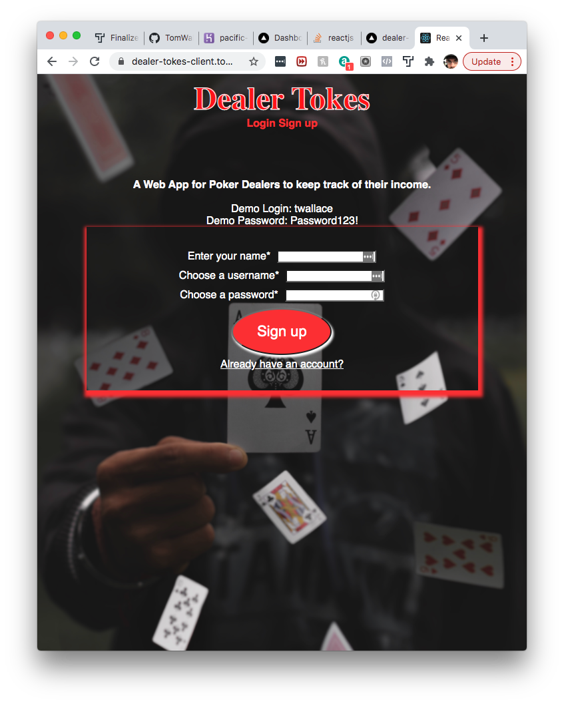
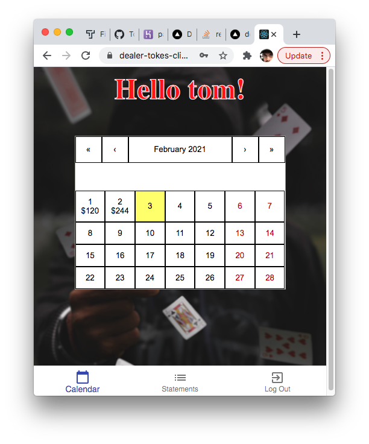
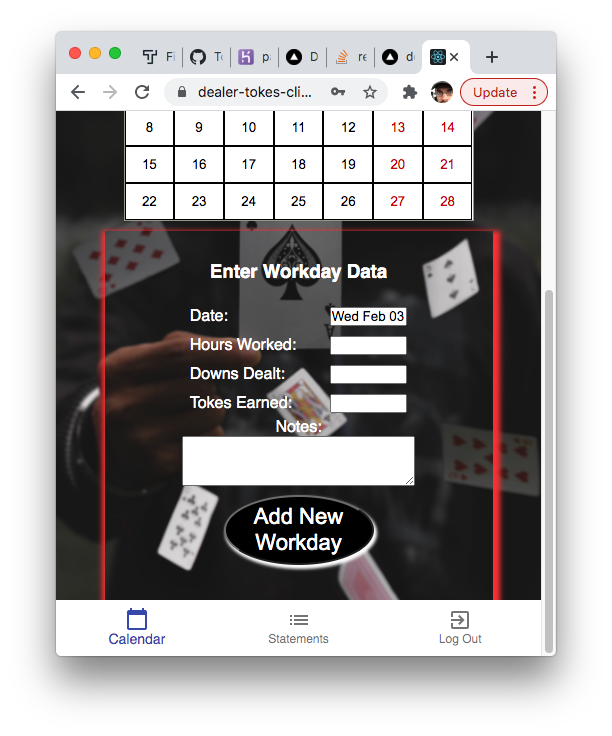
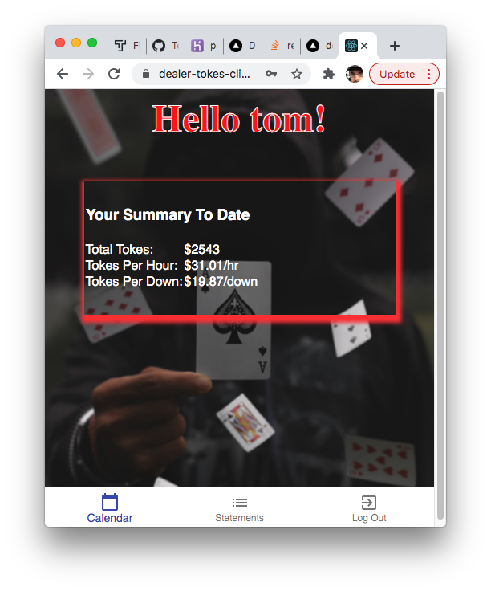

# Dealer Tokes Client
Thomas Wallace

LInk to Live APP - https://dealer-tokes-client.tomwallacejr.vercel.app
 Server Repo - https://github.com/TomWallaceJr/DealerTokes-Server
 Client Repo - https://github.com/TomWallaceJr/DealerTokes
Heroku -  https://pacific-retreat-10215.herokuapp.com/api

# Summary of App
This App built specifically for Poker Dealers, will allow users to track the days tehy work, how much they make in 'tokes' (casino talk for tips) as well as how much they make per hour and per down (number of tables dealt).

After registering and logging in, the user will be directed to the Dashboard route where they will see an interactive calendar. When the user selects a day, a component is rendered that will ask the user for the information on said workday. Once entered, the information is stored in a psql database on the server side.

The user may view their statement page which will calculate how much in tokes they've earned overall, how much they make per hour, and how much they make per down.

# API DOCUMENTATION
Example req/res requests

POST /api/user
*creates a new user and puts them in DB*
REQ BODY: {
    "username": "JohnnyBoy",
    "password": "Password123!",
    "name": "John Smith
}

Response:
[
    "username": "JohnnyBoy",
    "name": "John Smith",
]

GET /api/workday/2  
*returns all users workdays* 

Response:
[
{
    "id": 1,
        "hours": "5",
        "downs": "5",
        "tokes": "120",
        "notes": "YEEHAW",
        "date": "2021-02-01T00:00:00.000Z",
        "user_id": 2
},
{
        "id": 3,
        "hours": "8",
        "downs": "13",
        "tokes": "342",
        "notes": "Busy",
        "date": "2021-01-31T00:00:00.000Z",
        "user_id": 2
    },
    etc .... will return all users workdays
]

DELETE /api/workday/2
*will delete ALL USERS WORKDAYS*

DELETE /api/workday/2/date/2020-2-2
*Will Delete current users workday from that specific date*

POST /api/workday
*Enters a new workday into DB*
REQ BODY: {
        "hours": "4",
        "downs": "5",
        "tokes": "58",
        "notes": "Slow",
        "date": "2021-01-19",
        "user_id": 2
}

Response:
{
    "id": 14,
    "hours": "5",
    "downs": "4",
    "tokes": "58",
    "notes": "Slow",
    "date": "2021-02-04T00:00:00.000Z",
    "user_id": 2
}

DEMO LOGIN
USERNAME - twallace
PASSWORD - Password123!

